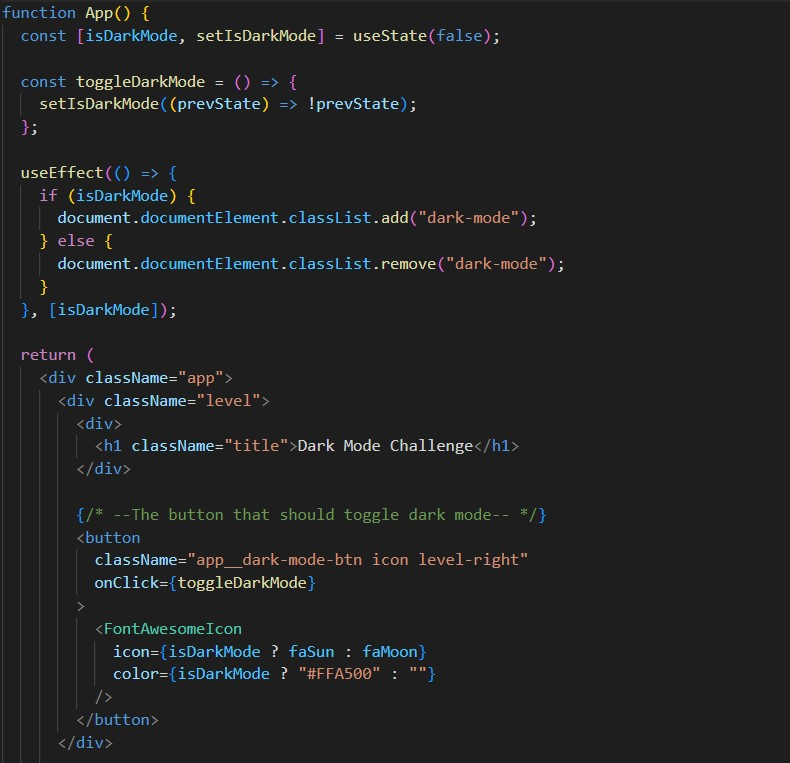

## Dark Mode Coding Challenge
This repository is forked from [react-coding-challege](https://github.com/alexgurr/react-coding-challenges) (only dark-mode part remained)  

&nbsp;
## Get started
- Please check [demo website](https://xieyou0608.github.io/react-coding-challenges-dark-mode/) directly.
- Or run `yarn` and then run `yarn start` to start app locally.
#### Environment
`node.js v16.16.0`

&nbsp;
## Solution
##### Approach
題目要求主要於 [[feat] Add dark mode](https://github.com/xieyou0608/react-coding-challenges-dark-mode/commit/ba9977adbe0a7f15cca54408daee1ae0ae4440b3) 這個 commit 完成，並且只有更動 App.js 檔案。做法為維護一個 boolean state (isDarkMode)，按下按鈕後依據當下狀態切換 light/dark 模式， isDarkMode 更新完成後會觸發 side effect(在 html DOM element 增加或刪除 "dark-mode" 這個 class)，而按鈕本身的 icon 圖示及顏色也依據 isDarkMode 進行改變(JSX部分)。

##### Other potential
如果專案發展的較大，在大量頁面或元件都需要依賴 isDarkMode 做改變的情況下，使用 useState Hook 加上 props 傳遞會相當難以開發，可以改成使用 Context API 或 Redux 來維護 isDarkMode，並且由用到 isDarkMode 的元件訂閱 store 即可。

&nbsp;
## Ref
- [Add a class to the Body element in React](https://bobbyhadz.com/blog/react-add-class-to-body-element)
- [How to fix SSL error when running app locally](https://stackoverflow.com/questions/69692842/error-message-error0308010cdigital-envelope-routinesunsupported)
If you run this app with node.js 18, you may encounter some ssl error, try downgrading to node.js 16 by nvm or check link above for more information.
- (unsolved) [bulma and dart sass conflict](https://github.com/jgthms/bulma/issues/3333)
This might be the reason why p tag could not display successfully in production environment(gh-pages).

&nbsp;
## Contact
Feel free to contact me!
:email: xyc.hsieh@gmail.com